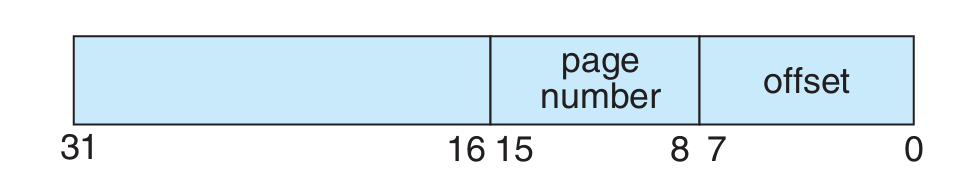
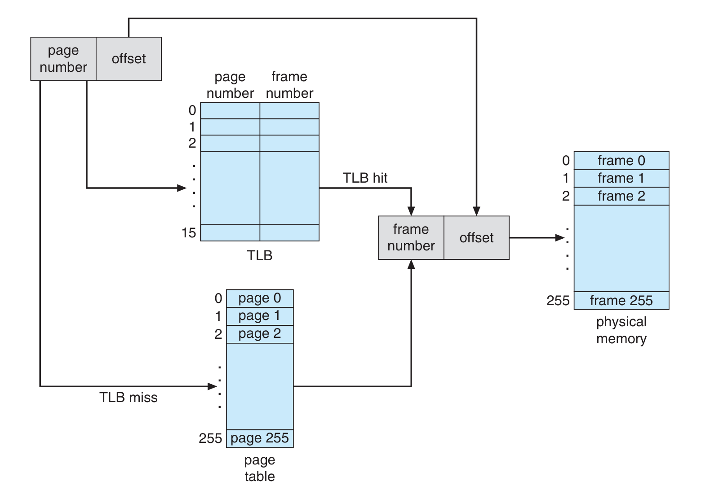

# Designing a Virtual Memory Manager

This project involves writing a program that translates logical addresses to physical addresses for a virtual address space of 65,536 bytes ($2^{16}$). The program will read logical addresses from a file and, using a Translation Lookaside Buffer (TLB) and a page table, translate each logical address to its corresponding physical address. For each translated physical address, the program will output the value of the byte stored at that address. The program will also handle page faults using demand paging, manage the TLB, and implement a page replacement algorithm.


## Specific 
Our program will read a file containing 10,000 32-bit integer values, each representing a logical address. Each logical address will then be split into two halves (16 bits each), but only the latter half will be used. This 16-bit value is further divided into two parts: (1) an 8-bit page number and (2) an 8-bit page offset. The structure of the addresses is as follows:

 Other specifics include the following:
*  $2^8$ entries in the page table
*  Pagesize of $2^8$ bytes
*  16 entries in the TLB
*  Frame size of $2^8$ bytes
*  128 frames
*  Physical memory of 65,536 bytes (128 frames × 256-byte frame size)
## Address Translation
Logical addresses will be translated into physical addresses using a TLB and a page table. First, the translation will consult the TLB, which will result in one of three possible cases:
1. **TLB hit:** the frame number is obtained from the TLB.
2. **TLB miss:** the page table must be consulted. 
3. **The latter case:** either the frame number is obtained from the page table, or a page fault occurs.

A visual representation of the address translation process is: 

## BACKING STORE
*  Before handling page faults, it's important to understand the **BACKING STORE**. This is a binary file of size *65,536 bytes* that stores data at the offsets of each page. It will be used when a page fault occurs. In this project, the BACKING STORE will be represented by the file **BACKING_STORE.bin**. 
*  **BACKING_STORE.bin** will be treated as a random-access file order to we can randomly seek to certain positions of the file for reading.


## Handling Page Faults
When a page fault occurs, our program will read in a 256-byte page from the file *BACKING STORE* and store it in anavailable page frame in physical memory.

**Example:**
*  If a logical address with page number 15 resulted in a page fault program would read in page 15 from *BACKING STORE* and store it in a page frame in physical memory.
*  Once this frame is stored (and the page table and TLB are updated), subsequent accesses to page 15 will be resolved by either the TLB or the page table.

## Page Replacement
In this project, the virtual address space consists of 256 pages, while the physical memory contains only 128 page frames. Therefore, a page replacement algorithm must be implemented to allocate free page frames for the pages. 
We will use either FIFO or LRU to resolve page faults when there is no free memory.

## Usage

To build the vm_manager executable, use the following command in the project's root directory:
```
make 
```

### Options

```
./vm_manager [OPTIONS]
```
| Option                              | Description                                                      |
| ----------------------------------- | ---------------------------------------------------------------- |
| `-h`, `--help`                      | Display the help message and usage information.                  |
| `-d`, `--default`                   | Use default values for all configurations.                       |
| `-p`, `--physical-memory-algorithm` | Set the algorithm for physical memory management: `FIFO`, `LRU`. |
| `-t`, `--tlb-algorithm`             | Set the algorithm for TLB management: `FIFO`, `LRU`, `OPTIMAL`.  |
| `-b`, `--backing-store`             | Specify the path to the backing store file.                      |
| `-i`, `--input-file`                | Specify the path to the input file.                              |
| `-o`, `--output-file`               | Specify the path to the output file.                             |
| `-l`, `--log-file`                  | Specify the path to the log file.                                |

#### Default Configuration

If no options are provided, the program uses the following default values:

    Physical Memory Algorithm: FIFO
    TLB Algorithm: FIFO
    Backing Store File: ./data/BACKING_STORE.bin
    Input File: ./data/addresses.txt
    Output File: ./data/outputFIFO.txt
    Log File: ./data/output.log


#### Example
To run the program with the default configuration:
```
./vm_manager -d
```
To specify algorithms and file paths:
```
./vm_manager -p LRU -t OPTIMAL -b ./data/custom_store.bin -i ./data/custom_addresses.txt -o ./data/custom_output.txt -l ./data/custom_log.txt
```
To quickly clean the project and remove intermediate files, use the following command:
```
make clean
```