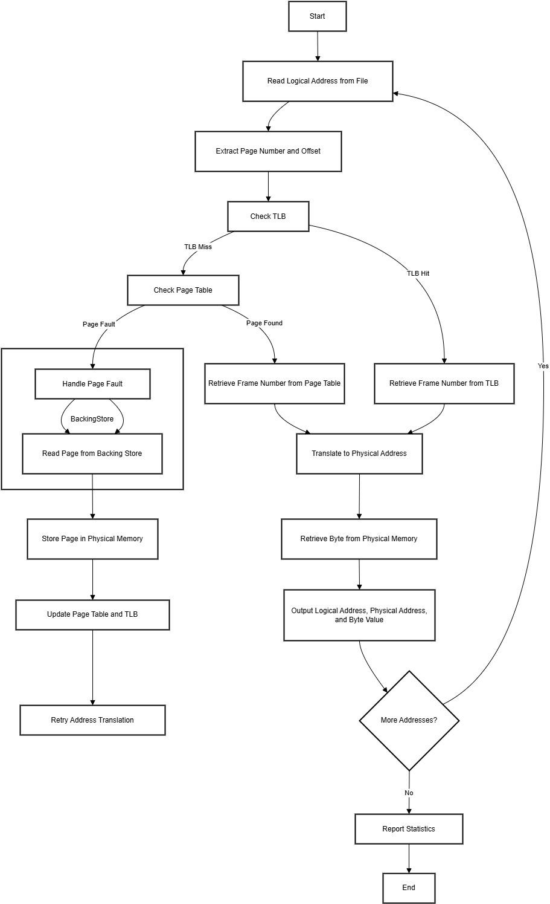

# Virtual Memory Manager - Design Document

## Table of Contents

- [Virtual Memory Manager - Design Document](#virtual-memory-manager---design-document)
  - [Table of Contents](#table-of-contents)
  - [1. Overview](#1-overview)
  - [2. Goals and Scope](#2-goals-and-scope)
    - [Goals:](#goals)
    - [Scope:](#scope)
  - [3. System Design](#3-system-design)
    - [High-Level Architecture](#high-level-architecture)
    - [TLB Replacement Strategy](#tlb-replacement-strategy)
    - [Key Components](#key-components)
  - [4. Workflow](#4-workflow)
    - [Flow chart](#flow-chart)
    - [Logical Address Translation](#logical-address-translation)
    - [Page Fault Handling](#page-fault-handling)
    - [TLB and Page Table Operations](#tlb-and-page-table-operations)
  - [5. Components Structures](#5-components-structures)
  - [6. Statistics and Output](#8-statistics-and-output)
    - [Metrics:](#metrics)
    - [Output Format:](#output-format)
  - [7. Testing Plan](#9-testing-plan)
    - [Test Scenarios:](#test-scenarios)
    - [Tools:](#tools)
  
---

## 1. Overview

The **Virtual Memory Manager** project simulates the translation of logical addresses to physical addresses using the following mechanisms:  
- **Translation Lookaside Buffer (TLB)** for fast page-to-frame lookups.  
- **Page Tables** to map logical pages to physical frames.  
- **Backing Store** to handle **page faults** when a page is not in memory.  
- **Demand Paging**: Pages are loaded into memory **only when they are needed**, optimizing memory usage.  
- **Page Replacement Strategies**: When physical memory is full, the project uses replacement algorithms to determine which page to evict, including:  
   - **FIFO** (First-In, First-Out)  
   - **LRU** (Least Recently Used)  
   - **OPT** (Optimal Page Replacement)  

The project operates with the following memory specifications:  
- **Page Entries**: 256 entries.
- **TLB Entries**: 16 entries.
- **Page Size**: 256 bytes.  
- **Frame Size**: 256 bytes.
- **addresses.txt**: 1000 lines, values ranging from 0 to 65,535.  
- **BACKING_STORE.bin (Virtual Address Space)**: 65,536 bytes (256 pages × 256-byte page size), simulating secondary storage for all virtual pages.

The system reads logical addresses from an **addresses.txt**, translates them into physical addresses, retrieves byte values, and outputs the results. Performance statistics, such as **TLB hit rate** and **page fault rate**, are tracked and reported.

---

## 2. Goals and Scope

### Goals:
- Simulate virtual memory address translation.
- Implement TLB and Page Table lookup mechanisms.
- Handle page faults by accessing the **Backing Store**.
- Output results: logical address, physical address, and byte value.
- Generate performance statistics like TLB hit/miss rate and page fault rate.

### Scope:
- Assume a simple **Paging System** with fixed page size.
- Support sequential address lookup from an input file.
- Store pages in a simulated **Physical Memory**.

---

## 3. System Design

### High-Level Architecture
The system follows a step-by-step process to simulate virtual memory management:  
1. **Input Handling**  
   Read logical addresses from an input file to initiate the simulation.

2. **Address Translation**  
   - Extract the page number and offset from the logical address.  
   - Check the TLB for a quick frame lookup.  
   - If a TLB miss occurs:  
     - Check the Page Table for the frame number.  
     - If the page is not in memory, handle the page fault as described below.

3. **Page Fault Handling**  
   - If a page is missing from physical memory, load it from the Backing Store.  
   - If physical memory is full, decide which page to evict using one of the supported **Page Replacement Strategies**:  
     - **FIFO (First-In, First-Out)**  
     - **LRU (Least Recently Used)**  

4. **Translation and Data Retrieval**  
   - Translate the logical address to a physical address using the frame number and offset.  
   - Retrieve the byte value from physical memory.  

5. **TLB Replacement Strategy**  
   The **Translation Lookaside Buffer (TLB)** stores recently accessed page-to-frame mappings to speed up address translation. TLB replacement occurs when the TLB is full, and a new entry must be added. Supported strategies include:  

   - **FIFO (First-In, First-Out)**: Evicts the earliest added entry when a new one is added.  
     - *Advantages*: Simple and easy to implement.  
     - *Disadvantages*: May be suboptimal if the access pattern lacks locality.  

   - **LRU (Least Recently Used)**: Replaces the least recently used entry.  
     - *Advantages*: Performs well for workloads exhibiting locality, approximating optimal behavior.  
     - *Disadvantages*: Tracking access order can add computational overhead.  

   - **OPT (Optimal Replacement)**: Replaces the entry that will not be used for the longest time in the future.  
     - *Advantages*: Provides theoretically optimal performance.  
     - *Disadvantages*: Requires knowledge of future memory accesses, making it suitable only for simulation or performance testing.  

6. **Output Generation**  
   - For each address translation, output the logical address, physical address, and byte value.

7. **Statistics Reporting**  
   - At the end of the simulation, report key performance metrics such as:  
     - **TLB hit rate**  
     - **Page fault rate**  
     - Other relevant statistics to evaluate the system's efficiency.  

### Key Components

| Component               | Description                                             |
|-------------------------|---------------------------------------------------------|
| **Logical Address File**| Input file containing logical addresses to be translated.|
| **TLB**                 | A small cache to store recent page-to-frame mappings, using FIFO, LRU, or Random replacement strategies. |
| **Page Table**          | Data structure mapping logical page numbers to physical frames. |
| **Backing Store**       | Simulated storage for pages not currently in physical memory. |
| **Physical Memory**     | Fixed-size memory (128 bytes) storing loaded pages.    |
| **Page Replacement**    | Implements **FIFO**, **LRU**, and **OPT** strategies for evicting pages when physical memory is full. |
| **Statistics Generator**| Tracks and reports TLB hits, misses, and page faults.   |

---

## 4. Workflow
### Flow chart



---

## 5. Components Structures

### **Structure: `VirtualMemory`**

The `VirtualMemory` structure is a core representation of virtual memory in the system. It contains the following fields:

1. **`data`**  
   - **Type**: `char *`  
   - **Use**: Represents the backing store, serving as storage for pages of virtual memory not currently in physical memory.  

2. **`address`**  
   - **Type**: `int *`  
   - **Use**: Holds pointers to logical addresses, allowing mapping and management of virtual memory locations.  

3. **`initialized`**  
   - **Type**: `bool`  
   - **Use**: A flag indicating whether the virtual memory system has been properly initialized, ensuring operations occur only after setup.
---
### **Structure: `PageTable`**

The `PageTable` structure represents the page table in a virtual memory system and includes the following components:

1. **`entries`**  
   - **Type**: `PageTableEntry *`  
   - **Use**: Points to an array of `PageTableEntry` structures, where each entry maps a page to a frame in physical memory.  

2. **`num_pages`**  
   - **Type**: `size_t`  
   - **Use**: Specifies the total number of pages the page table can manage.  

3. **`initialized`**  
   - **Type**: `bool`  
   - **Use**: A flag indicating whether the page table has been properly initialized and is ready for use.  

---

### **Structure: `PageTableEntry`**

The `PageTableEntry` structure is part of the `PageTable` and represents a single entry in the table. It includes:

1. **`frame_number`**  
   - **Type**: `int`  
   - **Use**: Stores the frame number in physical memory where the corresponding page resides.  

2. **`valid`**  
   - **Type**: `bool`  
   - **Use**: Indicates whether the page is currently loaded in physical memory (`true`) or not (`false`).  

---

### **Relationship**
The `PageTable` structure is a collection of `PageTableEntry` structures, each mapping a page to a specific frame in physical memory. Together, they enable efficient address translation by determining whether a page is in memory and, if so, providing its frame number.

---
### **Structure: `TLB`**

The `TLB` (Translation Lookaside Buffer) structure represents a hardware cache used to improve the speed of virtual-to-physical address translation. It includes the following components:

1. **`entries`**  
   - **Type**: `TLBEntry[TLB_ENTRIES]`  
   - **Use**: An array of `TLBEntry` structures, each mapping a logical page number to a physical frame number.  

2. **`replacement`**  
   - **Type**: `int`  
   - **Use**: Indicates the index or type of replacement policy being used (e.g., FIFO = 0, LRU = 1, OPT = 2).  

3. **`algorithm`**  
   - **Type**: `Algorithm`  
   - **Use**: Specifies the page replacement algorithm employed in the TLB (e.g., FIFO, LRU, OPT).  

4. **`algorithm_struct`**  
   - **Type**: `AlgorithmStruct`  
   - **Use**: Stores data and metadata specific to the replacement algorithm used.  

5. **`initialized`**  
   - **Type**: `bool`  
   - **Use**: A flag indicating whether the TLB has been properly initialized and is operational.  

---

### **Structure: `TLBEntry`**

The `TLBEntry` structure represents a single entry in the TLB. It includes:

1. **`page_number`**  
   - **Type**: `int`  
   - **Use**: Stores the logical page number being mapped.  

2. **`frame_number`**  
   - **Type**: `int`  
   - **Use**: Stores the physical frame number corresponding to the logical page.  

3. **`valid`**  
   - **Type**: `bool`  
   - **Use**: Indicates whether the entry is valid (`true`) or invalid (`false`).  

---

### **Relationship**
The `TLB` structure acts as a container for multiple `TLBEntry` instances, enabling rapid lookups for logical-to-physical address translations. The `replacement` field and associated algorithm components (`algorithm` and `algorithm_struct`) determine how entries are managed and replaced, ensuring optimal performance in a virtual memory system.

---
### **Structure: `PhysicalMemory`**

The `PhysicalMemory` structure represents the entire physical memory system and includes the following components:

1. **`frames`**  
   - **Type**: `Frame[TOTAL_FRAMES]`  
   - **Use**: An array of `Frame` structures, each representing a unit of storage in physical memory. Each `Frame` contains data and metadata for efficient memory management.

2. **`nums_frames`**  
   - **Type**: `int`  
   - **Use**: Stores the total number of frames available in the physical memory.  

3. **`algorithm`**  
   - **Type**: `Algorithm`  
   - **Use**: Specifies the page replacement algorithm (e.g., FIFO, LRU) being used for memory management.  

4. **`algorithm_struct`**  
   - **Type**: `AlgorithmStruct`  
   - **Use**: Holds data and metadata specific to the selected page replacement algorithm.  

5. **`initialized`**  
   - **Type**: `bool`  
   - **Use**: A flag indicating whether the physical memory has been properly initialized and is ready for use.  

---
### **Structure: `Frame`**

The `Frame` structure is an integral part of `PhysicalMemory`, representing a single storage unit within it. It includes:

1. **`valid`**  
   - **Type**: `bool`  
   - **Use**: Indicates whether the frame is in use (valid) or available (invalid).  

2. **`page_number`**  
   - **Type**: `int`  
   - **Use**: Stores the logical page number mapped to this frame.  

3. **`frame_data`**  
   - **Type**: `char[256]`  
   - **Use**: An array holding the actual data stored in this frame of physical memory.  

---

### **Relationship**
The `PhysicalMemory` structure uses the `frames` field to store and manage multiple `Frame` structures. Each `Frame` acts as a container for page data and provides metadata (e.g., validity and mapping) to facilitate efficient memory operations. Together, they represent and manage the physical memory in a virtual memory management system.

---

## 6. Statistics and Output
### Metrics:
- TLB Hit Count  
- Page Fault Count  
- Overall Address Translations (*1000 addresses*)  

### Output Format:
For each logical address, output:  
```
Logical Address: X Physical Address: Y Value: Z
```

At the end, report:  
```
Input file:           INPUTFILE
Output file:          OUTPUTFILE
Log file:             OUTPUT.LOG
Backing store file:   BACKING_STORE.bin
Algorithm (Memory):   A
Algorithm (TLB):      B
TLB hit rate:         XX%
Page-fault rate:      YY%
```

---

## 7. Testing Plan

### Test Scenarios:
1. **Basic Translation**: Logical addresses without page faults.  
2. **Page Fault Handling**: Simulate addresses causing page faults.  
3. **TLB Operations**: Validate TLB updates and replacement.  
4. **Edge Cases**: Invalid addresses, large input files, etc.

### Tools:
- Make file  

---
