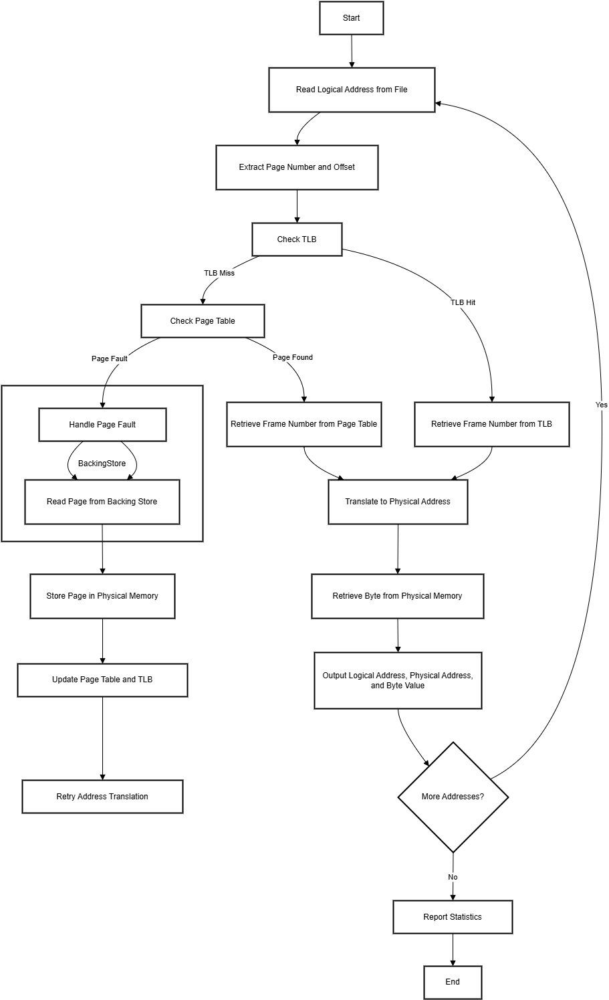

File **`design.md`** is describing overall structure for **Virtual Memory Manager** project.

---

# Virtual Memory Manager - Design Document

## Table of Contents

- [Virtual Memory Manager - Design Document](#virtual-memory-manager---design-document)
  - [Table of Contents](#table-of-contents)
  - [1. Overview](#1-overview)
  - [2. Goals and Scope](#2-goals-and-scope)
    - [Goals:](#goals)
    - [Scope:](#scope)
  - [3. System Design](#3-system-design)
    - [High-Level Architecture](#high-level-architecture)
    - [TLB Replacement Strategy](#tlb-replacement-strategy)
    - [Key Components](#key-components)
  - [4. Workflow](#4-workflow)
    - [Flow chart](#flow-chart)
    - [Logical Address Translation](#logical-address-translation)
    - [Page Fault Handling](#page-fault-handling)
    - [TLB and Page Table Operations](#tlb-and-page-table-operations)
  - [5. Data Structures](#5-data-structures)
  - [6. Error Handling](#6-error-handling)
  - [7. Performance Considerations](#7-performance-considerations)
  - [8. Statistics and Output](#8-statistics-and-output)
    - [Metrics:](#metrics)
    - [Output Format:](#output-format)
  - [9. Testing Plan](#9-testing-plan)
    - [Test Scenarios:](#test-scenarios)
    - [Tools:](#tools)
  - [10. Future Improvements](#10-future-improvements)

---

## 1. Overview

The **Virtual Memory Manager** project simulates the translation of logical addresses to physical addresses using the following mechanisms:  
- **Translation Lookaside Buffer (TLB)** for fast page-to-frame lookups.  
- **Page Tables** to map logical pages to physical frames.  
- **Backing Store** to handle **page faults** when a page is not in memory.  
- **Demand Paging**: Pages are loaded into memory **only when they are needed**, optimizing memory usage.  
- **Page Replacement Strategies**: When physical memory is full, the project uses replacement algorithms to determine which page to evict, including:  
   - **FIFO** (First-In, First-Out)  
   - **LRU** (Least Recently Used)  
   - **OPT** (Optimal Page Replacement)  

The project operates with the following memory specifications:  
- **Page Entries**: 256 entries.
- **TLB Entries**: 16 entries.
- **Page Size**: 256 bytes.  
- **Frame Size**: 256 bytes.
- **addresses.txt**: 1000 lines, values ranging from 0 to 65,535.  
- **BACKING_STORE.bin (Virtual Address Space)**: 65,536 bytes (256 pages × 256-byte page size), simulating secondary storage for all virtual pages.

The system reads logical addresses from an **addresses.txt**, translates them into physical addresses, retrieves byte values, and outputs the results. Performance statistics, such as **TLB hit rate** and **page fault rate**, are tracked and reported.

---

## 2. Goals and Scope

### Goals:
- Simulate virtual memory address translation.
- Implement TLB and Page Table lookup mechanisms.
- Handle page faults by accessing the **Backing Store**.
- Output results: logical address, physical address, and byte value.
- Generate performance statistics like TLB hit/miss rate and page fault rate.

### Scope:
- Assume a simple **Paging System** with fixed page size.
- Support sequential address lookup from an input file.
- Store pages in a simulated **Physical Memory**.

---

## 3. System Design

### High-Level Architecture
The system follows a step-by-step process to simulate virtual memory management:  

1. **Input Handling**: Read logical addresses from an input file.  
2. **Address Translation**:  
   - Extract the **page number** and **offset** from the logical address.  
   - Check the **TLB** for a quick frame lookup.  
   - If a TLB miss occurs, check the **Page Table** for the frame number.  
3. **Page Fault Handling**:  
   - If a page fault occurs (i.e., the page is not in physical memory), the system will load the missing page from the **Backing Store**.  
   - If physical memory is full, a **page replacement strategy** will be used to decide which page to evict. Supported page replacement strategies include:  
     - **FIFO (First-In, First-Out)**  
     - **LRU (Least Recently Used)**    
4. **Translation and Data Retrieval**:  
   - Translate the logical address to a physical address using the frame number and the offset.  
   - Retrieve the byte value from physical memory.  
5. **Output Generation**: Output the logical address, physical address, and byte value for each address translation.  
6. **Statistics**: Track and report **TLB hit rates**, **page fault rates**, and other performance metrics at the end of the simulation.

### TLB Replacement Strategy
The **Translation Lookaside Buffer (TLB)** stores recently accessed page-to-frame mappings to speed up address translation. The following TLB replacement strategies are supported:

- **FIFO (First-In, First-Out)**: The first TLB entry added is the first one evicted when a new entry is added.  
  - **Advantages**: Simple and easy to implement.
  - **Disadvantages**: May result in suboptimal performance, especially if the access pattern doesn’t exhibit locality.
  
- **LRU (Least Recently Used)**: The least recently used entry in the TLB is replaced when a new entry needs to be loaded.  
  - **Advantages**: Good performance for many workloads, as it approximates optimal behavior by assuming recently accessed pages are likely to be accessed again soon.
  - **Disadvantages**: Requires tracking access order, which can add overhead.

- **OPT (Optimal Replacement)**: The TLB entry that will not be used for the longest time in the future is replaced.  
  - **Advantages**: Theoretically provides the best performance by evicting the page that will be needed furthest in the future.
  - **Disadvantages**: Requires knowledge of future memory accesses, which is not available in most real systems. In practical terms, this strategy is often used for simulation or performance testing rather than real-world implementation.


### Key Components

| Component               | Description                                             |
|-------------------------|---------------------------------------------------------|
| **Logical Address File**| Input file containing logical addresses to be translated.|
| **TLB**                 | A small cache to store recent page-to-frame mappings, using FIFO, LRU, or Random replacement strategies. |
| **Page Table**          | Data structure mapping logical page numbers to physical frames. |
| **Backing Store**       | Simulated storage for pages not currently in physical memory. |
| **Physical Memory**     | Fixed-size memory (128 bytes) storing loaded pages.    |
| **Page Replacement**    | Implements **FIFO**, **LRU**, and **OPT** strategies for evicting pages when physical memory is full. |
| **Statistics Generator**| Tracks and reports TLB hits, misses, and page faults.   |

---

## 4. Workflow
### Flow chart




### Logical Address Translation
1. **Extract Page Number and Offset** from the logical address.  
2. **Check TLB**:  
   - If the page is in TLB → **TLB Hit** → Retrieve Frame Number.  
   - If the page is not in TLB → **TLB Miss** → Check Page Table.  
3. **Check Page Table**:  
   - If page is found → Retrieve Frame Number.  
   - If not → **Page Fault** → Handle Page Fault.  
4. **Translate to Physical Address**: Combine Frame Number and Offset.  
5. Retrieve the Byte Value from Physical Memory.

### Page Fault Handling

<!-- 1. Access the **Backing Store** to load the required page.  
2. Store the page in **Physical Memory**.  
3. Update both the **Page Table** and **TLB**.  
4. Retry the address translation. -->


We implement **demand paging**, where pages are loaded into physical memory only when they are needed (i.e., on a **page fault**). This ensures efficient use of memory and avoids preloading unnecessary pages.

When physical memory is full and a new page needs to be loaded, we use **page replacement strategies** to determine which page to evict. The following strategies are supported:

1. **FIFO (First-In, First-Out)**:  
   - Evicts the oldest page that was loaded into memory.  
   - Simple to implement and efficient for sequential access patterns.

2. **LRU (Least Recently Used)**:  
   - Evicts the page that has not been used for the longest time.  
   - Tracks page access history to approximate optimal performance.

The chosen page replacement strategy can be configured during runtime or testing.

### TLB and Page Table Operations
- **TLB Update**: Use a **FIFO** or **LRU** replacement policy for TLB entries.  
- **Page Table Update**: Add mappings for pages loaded during a page fault.

---

## 5. Data Structures

| Data Structure           | Description                                              |
|--------------------------|----------------------------------------------------------|
| **TLB**                  | Small, fixed-size array storing recent page-to-frame mappings. |
| **Page Table**           | Array mapping logical page numbers to physical frames.   |
| **Backing Store**        | Simulated disk holding all pages (e.g., binary file).    |
| **Physical Memory**      | Array representing the fixed-size memory.               |

---

## 6. Error Handling
- **Invalid Logical Address**: Skip the address and log a warning.  
- **Backing Store Access Failure**: Report and exit gracefully.  
- **Memory Overflow**: Replace pages using a simple replacement policy (e.g., FIFO).

---

## 7. Performance Considerations
- **TLB Hit Rate**: Minimize TLB misses using effective replacement policies.  
- **Page Fault Rate**: Efficiently handle page faults to minimize overhead.  
- **Memory Management**: Limit physical memory usage with a replacement strategy.

---

## 8. Statistics and Output
### Metrics:
- TLB Hit Count  
- Page Fault Count  
- Overall Address Translations (*1000 addresses*)  

### Output Format:
For each logical address, output:  
```
Logical Address: X Physical Address: Y Value: Z
```

At the end, report:  
```
Input file:           INPUTFILE
Output file:          OUTPUTFILE
Log file:             OUTPUT.LOG
Backing store file:   BACKING_STORE.bin
Algorithm (Memory):   A
Algorithm (TLB):      B
TLB hit rate:         XX%
Page-fault rate:      YY%
```

---

## 9. Testing Plan

### Test Scenarios:
1. **Basic Translation**: Logical addresses without page faults.  
2. **Page Fault Handling**: Simulate addresses causing page faults.  
3. **TLB Operations**: Validate TLB updates and replacement.  
4. **Edge Cases**: Invalid addresses, large input files, etc.

### Tools:
- Input Address File Generator  
- Unit Testing for each component (TLB, Page Table, etc.).

---

## 10. Future Improvements
- Implement **LRU** replacement policy for page replacement.  
- Optimize Backing Store access time.  
- Extend to multi-threaded virtual memory management.  
- Simulate demand paging algorithms (e.g., **FIFO**, **LRU**).  

---
