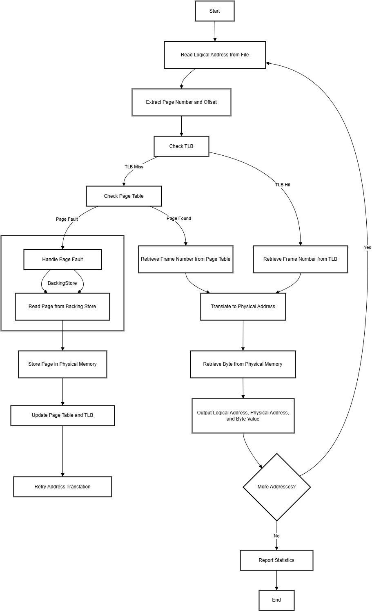

# Virtual Memory Manager - Design Document

### Group Members:
```
Member 1: Phạm Thanh An     MSSV: 23520027
Member 2: Đoàn Đức Anh      MSSV: 23520041
Member 3: Nguyễn Văn Hưng   MSSV: 23520569
Member 4: Trần Trọng Nghĩa  MSSV: 23521018
```

## Table of Contents

1. [Overview](#1-overview)  
2. [Input, Output And Statistic Report](#2-input-output-and-statistic-report)  
   2.1 [Input](#input)  
   2.2 [Output](#output)  
   2.3 [Statistic Report](#statistic-report)  
3. [Workflow](#3-workflow)  
   3.1 [High-Level Architecture](#high-level-architecture)  
   3.2 [Key Components](#key-components)  
4. [Algorithm](#4-algorithm)  
   4.1 [FIFO (First-In-First-Out) Algorithm](#fifo-first-in-first-out-algorithm)  
   4.2 [LRU (Least Recently Used) Algorithm](#lru-least-recently-used-algorithm)  
   4.3 [Optimal Page Replacement Algorithm](#optimal-page-replacement-algorithm)  
5. [Components Structures](#5-components-structures)  
   5.1 [Structure: VirtualMemory](#structure-virtualmemory)  
   5.2 [Structure: PageTable](#structure-pagetable)  
   5.3 [Structure: PageTableEntry](#structure-pagetableentry)  
   5.4 [Structure: TLB](#structure-tlb)  
   5.5 [Structure: TLBEntry](#structure-tlbenetry)  
   5.6 [Structure: PhysicalMemory](#structure-physicalmemory)  
   5.7 [Structure: Frame](#structure-frame)  
6. [Memory Specifications And Format](#6-memory-specifications-and-format)  
7. [Testing Plan](#7-testing-plan)  
   7.1 [Test Scenarios](#test-scenarios)  
   7.2 [Tools](#tools)  
8. [GitHub Repository](#github-repository)
  
---

## 1. Overview

The **Virtual Memory Manager** project simulates the translation of logical addresses to physical addresses, utilizing techniques such as **Translation Lookaside Buffers (TLB)**, **Page Tables**, **Page Fault Handling**, and **Page Replacement Algorithms**. This document outlines the system's design, its components, workflow, and testing strategies to implement a robust virtual memory management simulation.

---

## 2. Input, Output And Statistic Report

### - Input:
The system reads logical addresses from an **addresses.txt**
which contains *1,000* logical addresses ranging from *0* to *65535*.

### - Output:

 1. The logical address being translated (the integer value being read from
 addresses.txt).
 2. The corresponding physical address (what your program translates the
 logical address to).
 3. Thesigned byte value stored in physical memory at the translated physical address.

---

### - Statistic Report
Performance statistics, such as **TLB hit rate** and **page fault rate**, are tracked and reported.

---

## 3. Workflow

### High-Level Architecture
The system follows a step-by-step process to simulate virtual memory management:  
1. **Input Handling**  
   Read logical addresses from an input file to initiate the simulation.

2. **Address Translation**  
   - Extract the page number and offset from the logical address.  
   - Check the TLB for a quick frame lookup.  
   - If a TLB miss occurs:  
     - Check the Page Table for the frame number.  
     - If the page is not in memory, handle the page fault as described below.

3. **Page Fault Handling**  
   - If a page is missing from physical memory, load it from the Backing Store.  
   - If physical memory is full, decide which page to evict using one of the supported **Page Replacement Strategies**:  
     - **FIFO** (First-In, First-Out)  
     - **LRU** (Least Recently Used)  

4. **Stores recently accessed page-to-frame to TLB**  
   - The **Translation Lookaside Buffer (TLB)** is used to speed up address translation. TLB replacement occurs when the TLB is full, and a new entry must be added. Supported strategies include: 
     - **FIFO** (First-In, First-Out)  
     - **LRU** (Least Recently Used)
     - **OPT** (Optimal Page Replacement)  
 

5. **Translation and Data Retrieval**  
   - Translate the logical address to a physical address using the frame number and offset.  
   - Retrieve the byte value from physical memory.  

6. **Output Generation**  
   - For each address translation, output the logical address, physical address, and byte value.

7. **Statistics Reporting**  
   - At the end of the simulation, report key performance metrics such as:  
     - **TLB hit rate**  
     - **Page fault rate**  
     - Other relevant statistics to evaluate the system's efficiency.  

### Key Components

| Component               | Description                                             |
|-------------------------|---------------------------------------------------------|
| **Logical Address File**| Input file containing logical addresses to be translated.|
| **TLB**                 | A small cache to store recent page-to-frame mappings, using FIFO, LRU, or Random replacement strategies. |
| **Page Table**          | Data structure mapping logical page numbers to physical frames. |
| **Backing Store**       | Simulated storage for pages not currently in physical memory. |
| **Physical Memory**     | Fixed-size memory (128 bytes) storing loaded pages.    |
| **Page Replacement**    | Implements **FIFO**, **LRU**, and **OPT** strategies for evicting pages when physical memory is full. |
| **Statistics Generator**| Tracks and reports TLB hits, misses, and page faults.   |

---
### Flow chart



---

## 4. Algorithm

### **FIFO (First-In-First-Out) Algorithm**

The **FIFO (First-In-First-Out)** algorithm is used when **TLB hits** or **page-table faults** occur. In this algorithm, the first page added is the first one to be removed.

#### FIFO Implementation:
1. **Check for existing pages**: Before adding a new page, check if it is already present in the queue. If it is, skip the current page and do not modify the queue.
2. **Add page**: If there is space in the queue, append the new page to the end.
3. **Queue full**: If the queue is full, remove the page at the front (the oldest one) and add the new page at the end.

#### FIFO Structure:
- **int queue[]**:  
  A dynamically allocated array to store the elements of the queue.
- **int capacity**:  
  The maximum number of pages the queue can hold.
- **int front**:  
  The index of the front element in the queue (the oldest element).
- **int rear**:  
  The index where the next page will be added.
- **int size**:  
  The current number of pages in the queue.

#### FIFO Flowchart When Adding a Page:


#### Example of FIFO Algorithm:
For a system with a FIFO page replacement:
- **Capacity**: 3 pages.
- **Pages arriving**: 1, 2, 3, 2, 4, 3, 1.

#### Steps:
1. **Add page 1** → Memory: `[1]`
2. **Add page 2** → Memory: `[1, 2]`
3. **Add page 3** → Memory: `[1, 2, 3]`
4. **Add page 2** (already in memory) → Memory: `[1, 2, 3]`
5. **Add page 4** (replace the oldest page, 1) → Memory: `[2, 3, 4]`
6. **Add page 3** (already in memory) → Memory: `[2, 3, 4]`
7. **Add page 1** (replace the oldest page, 2) → Memory: `[3, 4, 1]`

#### Pros and cons: 

- **Advantages**: Provides theoretically optimal performance.  
- **Disadvantages**: Requires knowledge of future memory accesses, making it suitable only for simulation or performance testing.
---

### **LRU (Least Recently Used) Algorithm**

The **LRU (Least Recently Used)** algorithm replaces the page that has not been used for the longest time, assuming it is the least likely to be accessed again soon.

#### LRU Implementation:
1. Use the **'time'** variable to store the timestamp of each page's last access.
2. Before adding a page, increment the **'time'**.
3. If the page exists in the queue, update its **'time'** with the current value.
4. If the page does not exist and the queue has space, add it along with the current **'time'**.
5. If the queue is full, find the least recently used page and replace it.

#### LRU Structure:
- **LRUEntry table[]**:  
  A dynamically allocated array storing the page number and its timestamp.
- **unsigned long time**:  
  The current timestamp used for tracking when pages are accessed.
- **int capacity**:  
  The maximum number of pages the LRU cache can hold.
- **int size**:  
  The current number of pages in the LRU cache.

#### LRU Flowchart When Adding a Page:


#### Example of LRU Algorithm:
For a system with LRU page replacement:
- **Capacity**: 3 pages.
- **Pages arriving**: 1, 2, 3, 2, 4, 1.

#### Steps:
1. **Add page 1** → Memory: `[1]`
2. **Add page 2** → Memory: `[1, 2]`
3. **Add page 3** → Memory: `[1, 2, 3]`
4. **Access page 2** (hit) → Memory: `[1, 3, 2]`
5. **Add page 4** (replace least recently used page, 1) → Memory: `[3, 2, 4]`
6. **Add page 1** (replace least recently used page, 3) → Memory: `[2, 4, 1]`
7. **Final memory state** → Memory: `[2, 4, 1]`

#### Pros and cons: 

- **Advantages**: Performs well for workloads exhibiting locality, approximating optimal behavior.  
- **Disadvantages**: Tracking access order can add computational overhead. 
---

### **Optimal Page Replacement Algorithm**

The **Optimal Page Replacement** algorithm minimizes the number of page faults by replacing the page that will not be used for the longest period in the future.

#### OPT Implementation:
1. **Optimize future usage**: Prior to adding a new page, optimize the future usage by constructing an index of pages and their future access.
2. **Map page values**: Map larger page values to smaller ones to reduce search space.
3. **Construct index array**: Build an array where **idx[i][j]** tracks the nearest occurrence of page i from position j onwards.
4. **Check for existing pages**: Before adding a page, check if it already exists in memory.
5. **Add page**: If there is space, add the page to memory.
6. **Replace page**: If the memory is full, replace the page that will not be used for the longest period in the future.

#### OPT Flowchart When Adding a Page:


#### OPT Structure:
- **int page[]**:  
  Array to store the pages in memory.
- **int capacity**:  
  The maximum number of pages the queue can hold.
- **int size**:  
  Current number of pages in memory.
- **int future_usage[]**:  
  Array tracking the future usage of pages.
- **int map[]**:  
  Array used for mapping page values.
- **int idx[][]**:  
  Array optimized for quick access to the nearest future occurrences.

#### Example of OPT Algorithm:
For a system with OPT page replacement:
- **Capacity**: 3 pages.
- **Page request sequence**: 1, 2, 3, 2, 4, 1, 5.

#### Steps:
1. **Request page 1** → Add to memory → Memory: `[1]`
2. **Request page 2** → Add to memory → Memory: `[1, 2]`
3. **Request page 3** → Add to memory → Memory: `[1, 2, 3]`
4. **Request page 2** → Already in memory (no replacement).
5. **Request page 4** → Replace **1** (farthest future use) → Memory: `[4, 2, 3]`
6. **Request page 1** → Replace **3** (farthest future use) → Memory: `[4, 2, 1]`
7. **Request page 5** → Replace **2** (farthest future use) → Memory: `[4, 5, 1]`

#### Pros and cons: 

- **Advantages**: Provides theoretically optimal performance.  
- **Disadvantages**: Requires knowledge of future memory accesses, making it suitable only for simulation or performance testing.  

## 5. Components Structures
The next section will provide a detailed overview of the main structures used in the project to simulate the `Virtual Memory Manager`. 

### **Structure: `VirtualMemory`**

The following`VirtualMemory` structure is a core representation of virtual memory in the system. It contains the following fields:

1. **`data`**  
   - **Type**: `char *`  
   - **Use**: Represents the backing store, serving as storage for pages of virtual memory not currently in physical memory.  

2. **`address`**  
   - **Type**: `int *`  
   - **Use**: Holds pointers to logical addresses, allowing mapping and management of virtual memory locations.  

3. **`initialized`**  
   - **Type**: `bool`  
   - **Use**: A flag indicating whether the virtual memory system has been properly initialized, ensuring operations occur only after setup.
---
### **Structure: `PageTable`**

The `PageTable` structure represents the page table in a virtual memory system and includes the following components:

1. **`entries`**  
   - **Type**: `PageTableEntry *`  
   - **Use**: Points to an array of `PageTableEntry` structures, where each entry maps a page to a frame in physical memory.  

2. **`num_pages`**  
   - **Type**: `size_t`  
   - **Use**: Specifies the total number of pages the page table can manage.  

3. **`initialized`**  
   - **Type**: `bool`  
   - **Use**: A flag indicating whether the page table has been properly initialized and is ready for use.  

---

### **Structure: `PageTableEntry`**

The `PageTableEntry` structure is part of the `PageTable` and represents a single entry in the table. It includes:

1. **`frame_number`**  
   - **Type**: `int`  
   - **Use**: Stores the frame number in physical memory where the corresponding page resides.  

2. **`valid`**  
   - **Type**: `bool`  
   - **Use**: Indicates whether the page is currently loaded in physical memory (`true`) or not (`false`).  

---

### **Relationship**
The `PageTable` structure is a collection of `PageTableEntry` structures, each mapping a page to a specific frame in physical memory. Together, they enable efficient address translation by determining whether a page is in memory and, if so, providing its frame number.

---
### **Structure: `TLB`**

The `TLB` (Translation Lookaside Buffer) structure represents a hardware cache used to improve the speed of virtual-to-physical address translation. It includes the following components:

1. **`entries`**  
   - **Type**: `TLBEntry[TLB_ENTRIES]`  
   - **Use**: An array of `TLBEntry` structures, each mapping a logical page number to a physical frame number.  

2. **`replacement`**  
   - **Type**: `int`  
   - **Use**: Indicates the index or type of replacement policy being used (e.g., FIFO = 0, LRU = 1, OPT = 2).  

3. **`algorithm`**  
   - **Type**: `Algorithm`  
   - **Use**: Specifies the page replacement algorithm employed in the TLB (e.g., FIFO, LRU, OPT).  

4. **`algorithm_struct`**  
   - **Type**: `AlgorithmStruct`  
   - **Use**: Stores data and metadata specific to the replacement algorithm used.  

5. **`initialized`**  
   - **Type**: `bool`  
   - **Use**: A flag indicating whether the TLB has been properly initialized and is operational.  

---

### **Structure: `TLBEntry`**

The `TLBEntry` structure represents a single entry in the TLB. It includes:

1. **`page_number`**  
   - **Type**: `int`  
   - **Use**: Stores the logical page number being mapped.  

2. **`frame_number`**  
   - **Type**: `int`  
   - **Use**: Stores the physical frame number corresponding to the logical page.  

3. **`valid`**  
   - **Type**: `bool`  
   - **Use**: Indicates whether the entry is valid (`true`) or invalid (`false`).  

---

### **Relationship**
The `TLB` structure acts as a container for multiple `TLBEntry` instances, enabling rapid lookups for logical-to-physical address translations. The `replacement` field and associated algorithm components (`algorithm` and `algorithm_struct`) determine how entries are managed and replaced, ensuring optimal performance in a virtual memory system.

---
### **Structure: `PhysicalMemory`**

The `PhysicalMemory` structure represents the entire physical memory system and includes the following components:

1. **`frames`**  
   - **Type**: `Frame[TOTAL_FRAMES]`  
   - **Use**: An array of `Frame` structures, each representing a unit of storage in physical memory. Each `Frame` contains data and metadata for efficient memory management.

2. **`nums_frames`**  
   - **Type**: `int`  
   - **Use**: Stores the total number of frames available in the physical memory.  

3. **`algorithm`**  
   - **Type**: `Algorithm`  
   - **Use**: Specifies the page replacement algorithm (e.g., FIFO, LRU) being used for memory management.  

4. **`algorithm_struct`**  
   - **Type**: `AlgorithmStruct`  
   - **Use**: Holds data and metadata specific to the selected page replacement algorithm.  

5. **`initialized`**  
   - **Type**: `bool`  
   - **Use**: A flag indicating whether the physical memory has been properly initialized and is ready for use.  

---
### **Structure: `Frame`**

The `Frame` structure is an integral part of `PhysicalMemory`, representing a single storage unit within it. It includes:

1. **`valid`**  
   - **Type**: `bool`  
   - **Use**: Indicates whether the frame is in use (valid) or available (invalid).  

2. **`page_number`**  
   - **Type**: `int`  
   - **Use**: Stores the logical page number mapped to this frame.  

3. **`frame_data`**  
   - **Type**: `char[256]`  
   - **Use**: An array holding the actual data stored in this frame of physical memory.  

---

### **Relationship**
The `PhysicalMemory` structure uses the `frames` field to store and manage multiple `Frame` structures. Each `Frame` acts as a container for page data and provides metadata (e.g., validity and mapping) to facilitate efficient memory operations. Together, they represent and manage the physical memory in a virtual memory management system.

---

## 6. Memory Specifications And Format
### Memory specifications:
- **Page Entries**: 256 entries.
- **TLB Entries**: 16 entries.
- **Page Size**: 256 bytes.  
- **Frame Size**: 256 bytes.
- **addresses.txt**: 1000 lines, values ranging from 0 to 65,535.  
- **BACKING_STORE.bin (Virtual Address Space)**: 65,536 bytes (256 pages × 256-byte page size), simulating secondary storage for all virtual pages.

### Metrics:
- TLB Hit Count  
- Page Fault Count  
- Overall Address Translations (*1000 addresses*)  

### Output Format:
For each logical address, output:  
```
Logical Address: X Physical Address: Y Value: Z
```

At the end, report:  
```
Input file:           INPUTFILE
Output file:          OUTPUTFILE
Log file:             OUTPUT.LOG
Backing store file:   BACKING_STORE.bin
Algorithm (Memory):   A
Algorithm (TLB):      B
TLB hit rate:         XX%
Page-fault rate:      YY%
```

---

## 7. Testing Plan

### Test Scenarios:
1. **Basic Translation**: Logical addresses without page faults.  
2. **Page Fault Handling**: Simulate addresses causing page faults.  
3. **TLB Operations**: Validate TLB updates and replacement.  
4. **Edge Cases**: Invalid addresses, large input files, etc.

### Tools:
- Make file  


---

## GitHub Repository

For the full source code and documentation, visit our repository: [GitHub Repository](https://github.com/BabyBroder/VirtualMemoryManager)

---
